# Airbnb Price Prediction

Final Python Project 

Team: Violet-2

Team Members: 

[Fjollë Gjonbalaj](https://github.com/Fjolle)

[Brendan Ok](https://github.com/brendanok)

[Abby Johnson](https://github.com/johnsonabigail)

[Victor Besse](https://github.com/Victor-Besse)

[Christina Ridlen](https://github.com/csridlen)

[Steven Kim](https://github.com/su1214)

## Introduction

We use a combination of explanatory data analysis, model prediction and machine learning to predict Airbnb rental prices based on variables found from [insideairbnb.com](insideairbnb.com). We build trained models, including a linear regression and a lasso regression. The highest performing analysis was the gradient boosted tree model. We compare the performance of models based on the RMSE (the standard deviation of the residuals/prediction errors). We then build an interface in Streamlit to present our results.

### The goal
Allowing airbnb hosts to predict a reasonable price for their airbnb listing based on certain qualities.

## Data Collection

The main source of data contains Airbnb data for the city of New York for the year 2021. The data was made available by [Inside Airbnb](http://insideairbnb.com/get-the-data/). We downloaded the three scraped datasets from this website. They were scraped in June, September, and December. They are in our repository.

We also used data published by New York City's various institutions including locations of [subway stations](https://data.cityofnewyork.us/Transportation/Subway-Stations/arq3-7z49) and [parks](https://data.cityofnewyork.us/City-Government/ARCHIVED-Parks-Zones/rjaj-zgq7) as well as [neighboorhood](https://data.cityofnewyork.us/City-Government/2020-Neighborhood-Tabulation-Areas-NTAs-Tabular/9nt8-h7nd) areas.

### Data Cleaning
We first cleaned the data using the [Aggregate Listings Data.ipynb](https://github.com/csridlen/eco395m-project-2/blob/main/cleaning_code_from_lauri/1.%20Download%20and%20compile%20data/Aggregate%20Listings%20Data.ipynb) [1st_stage_panel_data_cleaning.ipynb](https://github.com/csridlen/eco395m-project-2/blob/main/cleaning_code_from_lauri/2.%20Clean%20data/1st_stage_panel_data_cleaning.ipynb) and put our dataset into the sql database, which we got from [this repo](https://github.com/kytola/CleanAirbnb).
The first one concatenates the datasets we obtained and selects the coulmns of interest.
The second one destrings the price, formats the dates, fills in NA values, calculates the average longitude and latitude (as Airbnb does not provide exact locations for privacy), flags the month where a listing is first hosted, flags the month where a listing is last hosted, calculates cumulative listings for a given host, calculates other summary statistics about host holdings, identify hotels in the data, calculate listings per neighborhood, and drops observations where property price is below 0.1 percentile or above 99.9 percentile, property never lists a day of availability, and minimum nights is 30 days or more (no longer a short-term rental).

### Data Summary
In the dataset from Inside Airbnb, each row is an individual airbnb listing and the columns are characteristics of listings such as price, reviews, and availability. Also included are details about the host such as response time, count of other listings, and an indicator for super host.

The GeoJSON data from the NYC OpenData portal contain coordinates that are used to form the geometry for maps. The subway station data are individual coordinate points for each subway station in the city. The neighborhoods and parks data uses multiple coordinates to create an area or “zone” of where the neighborhoods and parks are located.

## Preliminary Analysis: Summary Statistics

We did some preliminary analysis and visualizations in order to better understand our data. Below you can see some of those results:

We created a violin plot to showcase density and distribtuion of prices in different New York City neighbourhoods. We remove extreme values from the price variable by limiting this analysis on prices less than $250. It is clear from the plot that Manhattan has the highest average airbnb price among neighbourhood groups. 

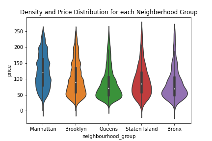

We also show top 5 neighbourhoods by room type based on calculated host listings. It is possible that hosts with more listings charge higher prices. This might be an indicator that more experienced hosts know the market better. This plot shows that Bedford-Stuyvesant has the highest calculated host listings, so we would expect to see higher prices in this neighbourhood group compared to other neighbourhood groups. Further, private rooms have more host listings than entire home/apt in all instances except for Hell's Kitchen. 

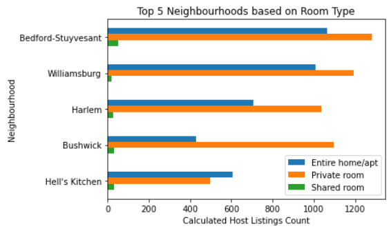

We also created a boxplot showing airbnb prices for each neighborhood group based on room type. We can see from the boxplot that Manhattan has the highest airbnb prices among neighbourhood, followed by Brooklyn and Queens. In all instances, entire home/apartments are more expensive than private rooms and shared rooms. 

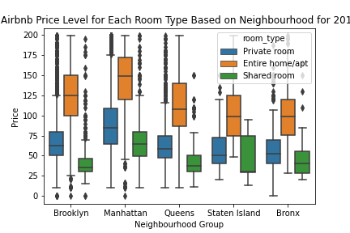

The heatmap below shows airbnb prices in New York City based on latitute and longitude. 

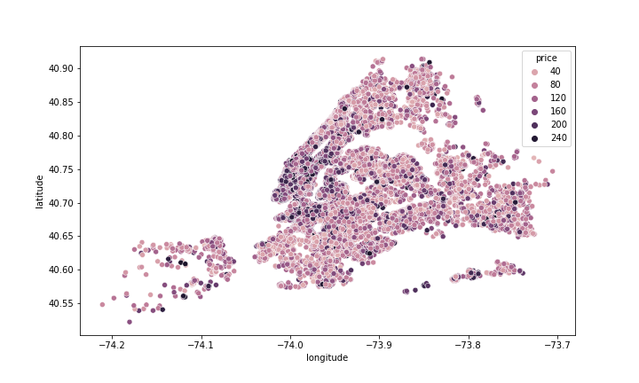

The second heatmap shows each major neighbourhood group in New York City based on latitute and longitude. 

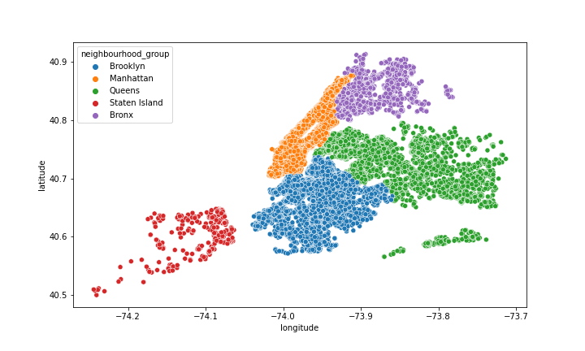

## Average prices by neighborhood
An issue that we found initially is that the neighborhoods as defined in the Inside Airbnb dataset isn't consistent with the neighborhoods as reported to the Decennial Census and American Community Survey. So we recoded the neighborhoods to the [updated neighborhoods](https://data.cityofnewyork.us/City-Government/2020-Neighborhood-Tabulation-Areas-NTAs-Tabular/9nt8-h7nd) found through the NYC OpenData portal. 

The updated neighborhoods divide up the city into smaller and more groups. Below is a map of average Airbnb Prices grouped by neighborhoods.

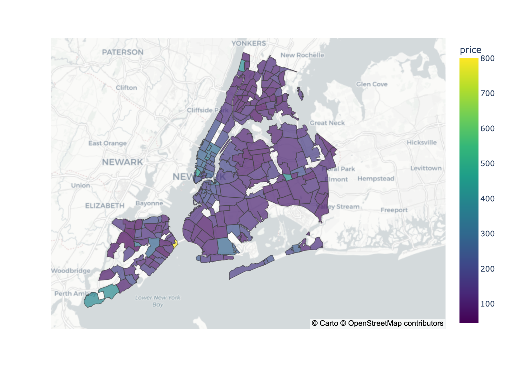 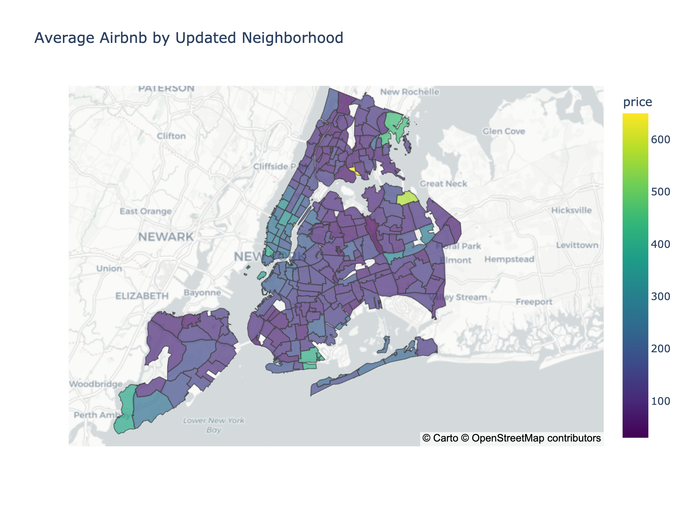

Refer to [here](https://htmlpreview.github.io/?https://github.com/csridlen/eco395m-project-2/blob/main/artifacts/neighbourhood_price_2021_2.html) to see an interative plot with actual prices per neighborhood.

### Subway station and park zones
We decided to use proximity to subway stations and parks as a predictor in Airbnb prices. For each Airbnb listing, we calculated the distance to the nearest subway and park. We calculated distance using the Manhattan distance formula (Also known as taxicab geomery and named after the borough of course). This distance calculation is different from a traditional distance formula as it's the distance that would be used to for an individual that might drive or walk to a destination rather than distance that would cut through lots and buildings.

Plots below show the distance to the nearest [park](https://htmlpreview.github.io/?https://github.com/csridlen/eco395m-project-2/blob/main/artifacts/nearest_park2.html) and [station](https://htmlpreview.github.io/?https://github.com/csridlen/eco395m-project-2/blob/main/artifacts/nearest_station_2.html). 

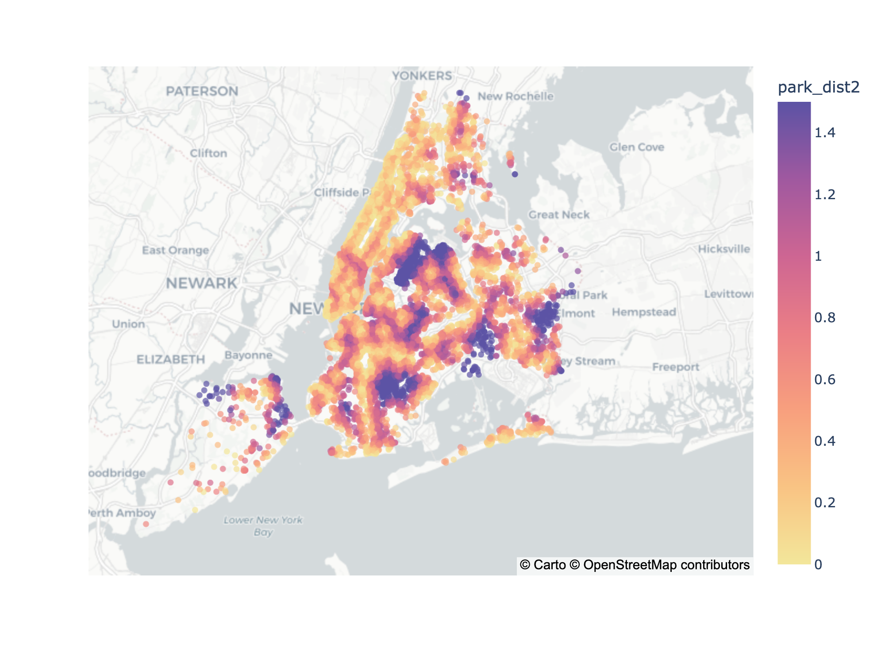

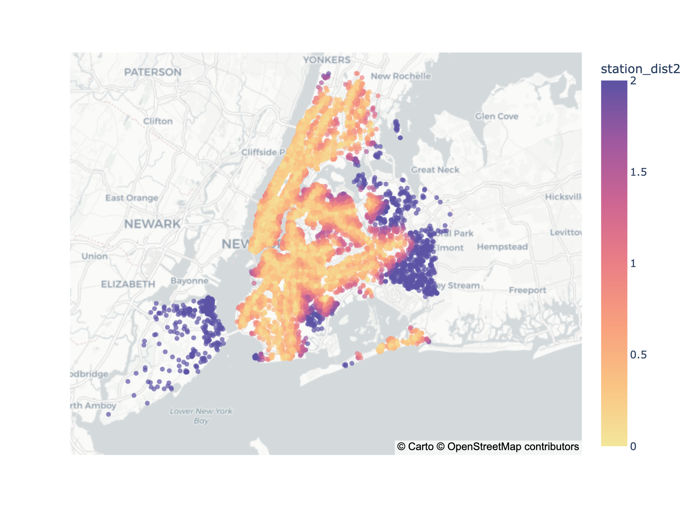

## #Data Dictionary 

[Inside Airbnb](https://docs.google.com/spreadsheets/d/1iWCNJcSutYqpULSQHlNyGInUvHg2BoUGoNRIGa6Szc4/edit#gid=982310896)

## Database

## Methodology
We use a gradient boosted tree model to predict Airbnb prices. We one-hot-encoded categorical variables and tried to include as many relevant indicators as possible. To estimate the model yourself, see [predict.ipynb](https://github.com/csridlen/eco395m-project-2/blob/main/code/predict.ipynb). We also exctract variable importance from the gradient boosted model to narrow down for sellers which variables are most important. 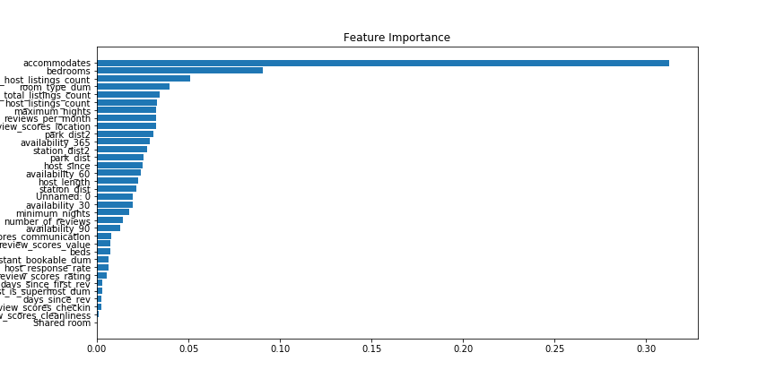

## Dashboard Creation

## Analysis/Findings

We first run a simple linear regression of airbnb price on neighbourhood and on borough separately to see which basic geographic division is more helpful, we find that neighbourhoods are. We then add other controls and test a few different combinations and find that the best model contains neighbourhoods, different review scores, subway and park linear distance, and a feature like number of guests accommodated / beds that serve as a good proxy of relative size.

Our best model has an R-squared of ~0.47 and a RMSE of about 100. While this is much higher than we'd have expected based on early stage analysis, the predictive power of the model is not amazing given the error and range og typical airbnb prices. Consequently we use a Rainbow test for linearity to check whether a linear model is the best choice here, and reject the hypothesis that it is. This motivates analysis using a different model such as GBM

Reproducibility: All is found in . This includes step by step detailed instructions and comments.

In order to draw comparisons, we also build a lasso model. Although lasso is an extension of the linear regression, in general we would expect that the former would perform better than the latter since the former trades an increase in bias for a decrease in variance. To perform this analysis we first create a list of alphas (the parameter which balances the amount of emphasis given to minimizing RSS vs minimizing sum of square of coefficients) to tune. We find the best value of alpha of 0.007. This is very close to zero, so we could expect to receive very similar results/coefficients to the linear regression. In order to visualize the residuals of the lasso model, we plot the residuals against the predicted values. The graph below shows the distribution of these residuals. 

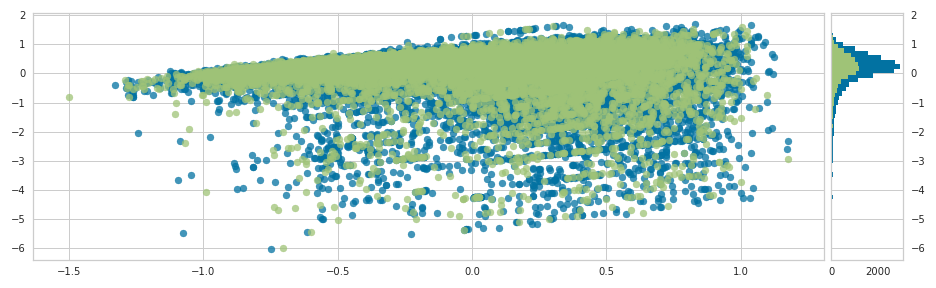

We also plot the lasso errors, 

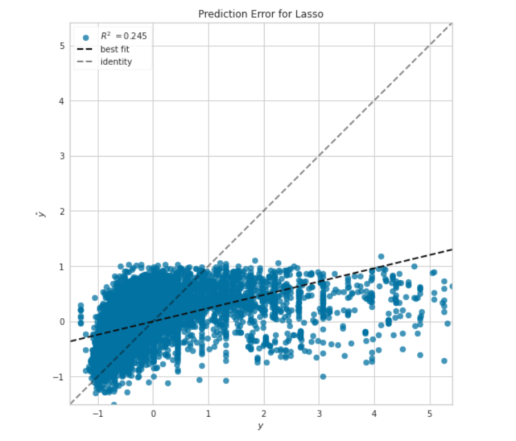

We then perform feature selection by keeping only the non-zero coefficients in the final model. We see that variables minimum_nights, and room_type are negatively related to the dependent variable price, whereas, variables availability_365, calculated_host_listings_count, neighbourhood and neighbourhood_group are positively related to price. 

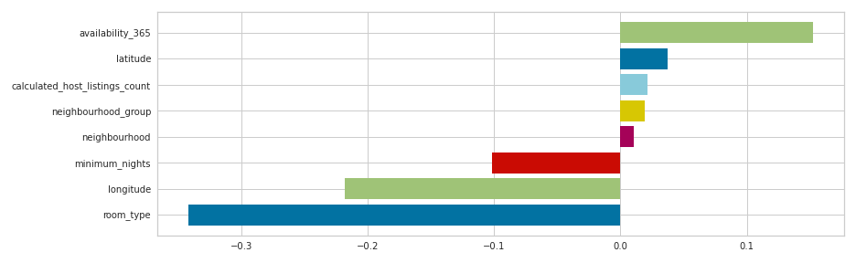

With an R2 of 0.245 lasso performs seldom better than the linear model, with an R2 of 0.243. 

## Conclusions

## Reproducability Instructions

First, get the datasets.
Put the .csv.gz files in the directory named *united-states_new-york-city* under *cleaning_code_from_lauri/0. Raw Data*.
Run *1. Download and compile data/Aggregate Listings Data.ipynb*. This creates *NYC_Data_wideALL_2021.csv.gz* and *NYC_Data_longALL_2021.csv.gz* in *1. Download and compile data*.
Copy the file `demo.env` to `.env` and modify it by providing the credentials theaccordingly, both in */code/* and 
*cleaning_code_from_lauri/2. Clean data/*.
Then, run *2. Clean data/1st_stage_panel_data_cleaning.ipynb*.
This creates *NYC_1stStageClean_2021* in *Saved data* and puts in into the SQL database (We used Postgres).
Plus, you need to update those in *readtable.py*, which has a function to query relevant columns needed for the analysis.
maps.ipynb spits out *data/newnh_airbnb_2021.csv* and maps. 
neighborhood_distances.py then uses it to spit out *cleaned_data_updated.csv*.
This is used for baseline analyses. We use the entire dataset we have for the predictive model building.
*analysis_visualizations.ipynb* gives you the graphs.

(model building and dashboard building description)

## Extensions and Limitations

## Appendix
